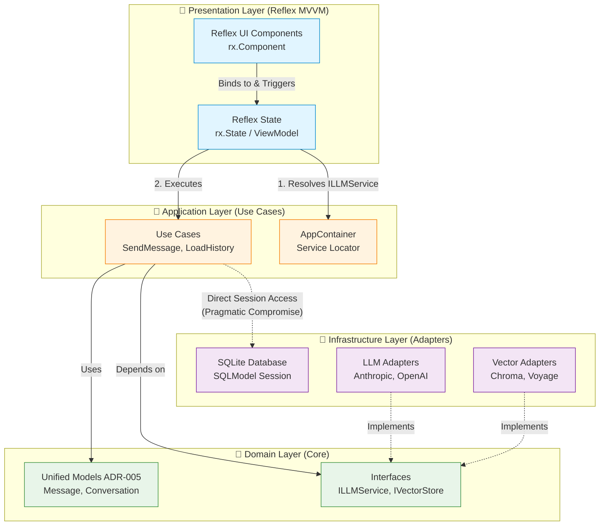
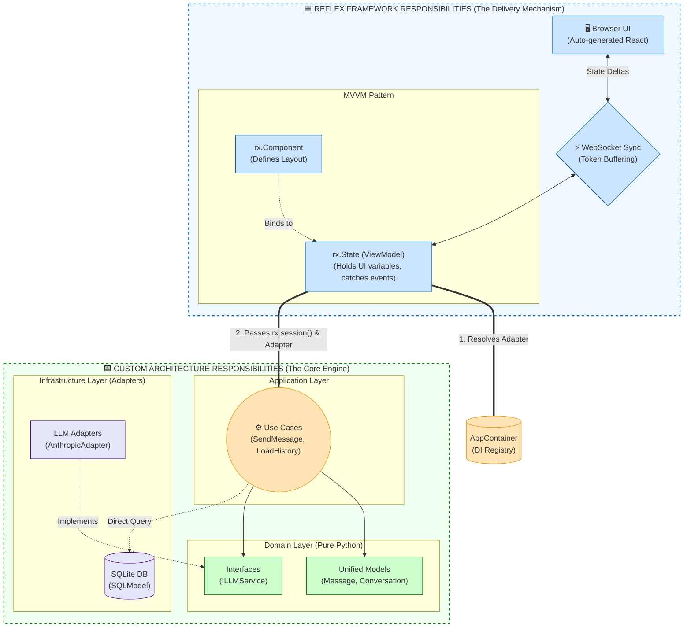

```mermaid
graph TD
    subgraph "🎨 Presentation Layer (Reflex MVVM)"
        UI[Reflex UI Components<br/>rx.Component]
        STATE[Reflex State<br/>rx.State / ViewModel]

        UI -- "Binds to & Triggers" --> STATE
    end

    subgraph "🎯 Application Layer (Use Cases)"
        UC[Use Cases<br/>SendMessage, LoadHistory]
        DI[AppContainer<br/>Service Locator]

        STATE -- "1. Resolves ILLMService" --> DI
        STATE -- "2. Executes" --> UC
    end

    subgraph "💎 Domain Layer (Core)"
        ENT[Unified Models ADR-005<br/>Message, Conversation]
        INT[Interfaces<br/>ILLMService, IVectorStore]

        UC -- "Uses" --> ENT
        UC -- "Depends on" --> INT
    end

    subgraph "🔧 Infrastructure Layer (Adapters)"
        SQL[SQLite Database<br/>SQLModel Session]
        OAI[LLM Adapters<br/>Anthropic, OpenAI]
        VDB[Vector Adapters<br/>Chroma, Voyage]

        OAI -. "Implements" .-> INT
        VDB -. "Implements" .-> INT

        %% The Pragmatic Compromise
        UC -. "Direct Session Access<br/>(Pragmatic Compromise)" .-> SQL
    end

    %% Styling
    style UI fill:#e1f5ff,stroke:#0288d1
    style STATE fill:#e1f5ff,stroke:#0288d1
    style UC fill:#fff3e0,stroke:#f57c00
    style DI fill:#fff3e0,stroke:#f57c00
    style ENT fill:#e8f5e9,stroke:#388e3c
    style INT fill:#e8f5e9,stroke:#388e3c
    style SQL fill:#f3e5f5,stroke:#7b1fa2
    style OAI fill:#f3e5f5,stroke:#7b1fa2
    style VDB fill:#f3e5f5,stroke:#7b1fa2
```

```mermaid
flowchart TB
    %% --- REFLEX BOUNDARY ---
    subgraph ReflexZone ["🟦 REFLEX FRAMEWORK RESPONSIBILITIES (The Delivery Mechanism)"]
        direction TB
        UI["🖥️ Browser UI<br/>(Auto-generated React)"]
        WS{"⚡ WebSocket Sync<br/>(Token Buffering)"}

        subgraph MVVM ["MVVM Pattern"]
            VIEW["rx.Component<br/>(Defines Layout)"]
            STATE["rx.State (ViewModel)<br/>(Holds UI variables, catches events)"]
        end

        UI <-->|State Deltas| WS
        WS <--> STATE
        VIEW -.->|Binds to| STATE
    end

    %% --- THE BRIDGE ---
    STATE == "1. Resolves Adapter" === DI[("AppContainer<br/>(DI Registry)")]
    STATE == "2. Passes rx.session() & Adapter" === UC

    %% --- CUSTOM ARCHITECTURE BOUNDARY ---
    subgraph ArchZone ["🟩 CUSTOM ARCHITECTURE RESPONSIBILITIES (The Core Engine)"]
        direction TB

        subgraph AppLayer ["Application Layer"]
            UC(("⚙️ Use Cases<br/>(SendMessage, LoadHistory)"))
        end

        subgraph DomainLayer ["Domain Layer (Pure Python)"]
            ENT["Unified Models<br/>(Message, Conversation)"]
            INT["Interfaces<br/>(ILLMService)"]
        end

        subgraph InfraLayer ["Infrastructure Layer (Adapters)"]
            SQL[("SQLite DB<br/>(SQLModel)")]
            LLM["LLM Adapters<br/>(AnthropicAdapter)"]
        end

        UC --> ENT
        UC --> INT

        LLM -.->|Implements| INT
        UC -.->|Direct Query| SQL
    end

    %% Styling
    style ReflexZone fill:#f0f8ff,stroke:#0066cc,stroke-width:2px,stroke-dasharray: 5 5
    style ArchZone fill:#f0fff0,stroke:#008000,stroke-width:2px,stroke-dasharray: 5 5

    style UI fill:#cce5ff,stroke:#0066cc
    style WS fill:#cce5ff,stroke:#0066cc
    style VIEW fill:#cce5ff,stroke:#0066cc
    style STATE fill:#cce5ff,stroke:#0066cc
    style DI fill:#ffe4b5,stroke:#ff8c00

    style UC fill:#ffe4b5,stroke:#ff8c00
    style ENT fill:#ccffcc,stroke:#008000
    style INT fill:#ccffcc,stroke:#008000

    style SQL fill:#e6e6fa,stroke:#4b0082
    style LLM fill:#e6e6fa,stroke:#4b0082
```
