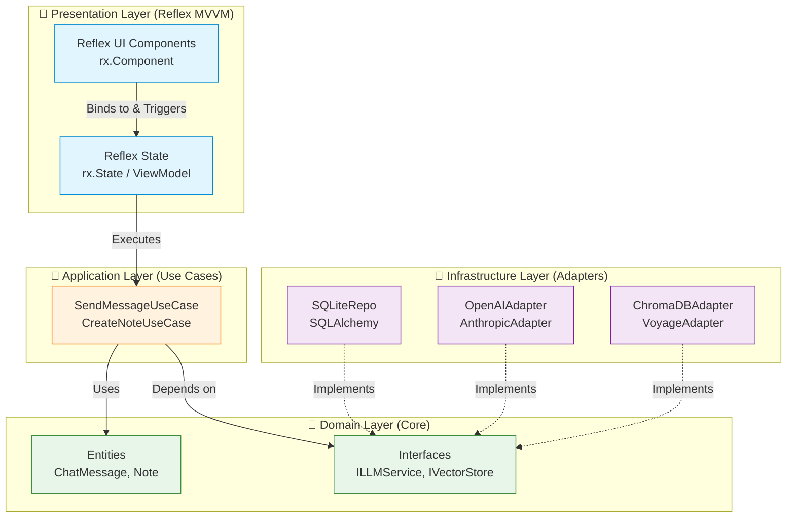
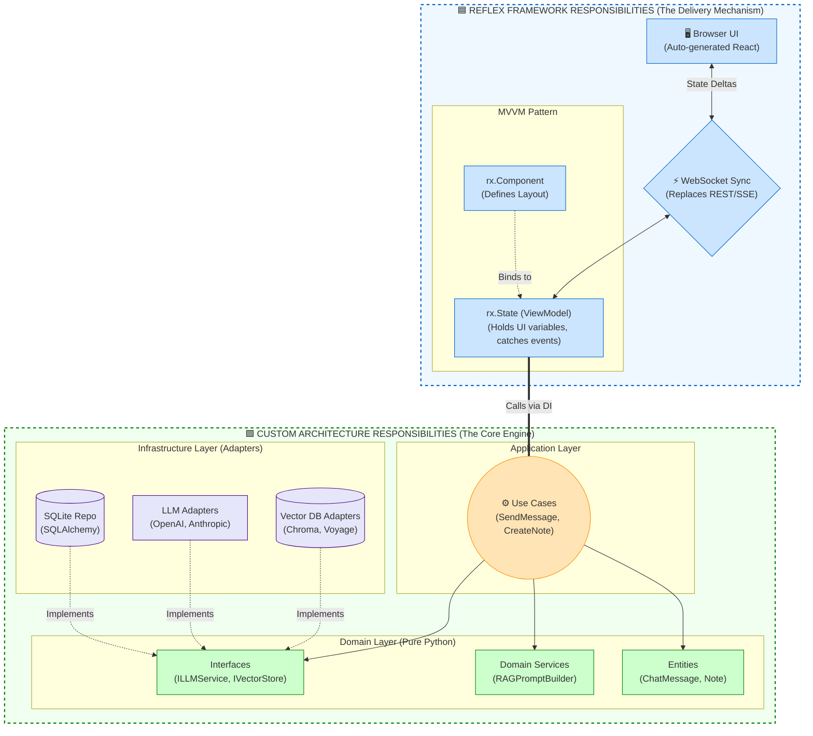

```mermaid
graph TD
    subgraph "🎨 Presentation Layer (Reflex MVVM)"
        UI[Reflex UI Components<br/>rx.Component]
        STATE[Reflex State<br/>rx.State / ViewModel]
        
        UI -- "Binds to & Triggers" --> STATE
    end

    subgraph "🎯 Application Layer (Use Cases)"
        UC[SendMessageUseCase<br/>CreateNoteUseCase]
        
        STATE -- "Executes" --> UC
    end

    subgraph "💎 Domain Layer (Core)"
        ENT[Entities<br/>ChatMessage, Note]
        INT[Interfaces<br/>ILLMService, IVectorStore]
        
        UC -- "Uses" --> ENT
        UC -- "Depends on" --> INT
    end

    subgraph "🔧 Infrastructure Layer (Adapters)"
        SQL[SQLiteRepo<br/>SQLAlchemy]
        OAI[OpenAIAdapter<br/>AnthropicAdapter]
        VDB[ChromaDBAdapter<br/>VoyageAdapter]
        
        SQL -. "Implements" .-> INT
        OAI -. "Implements" .-> INT
        VDB -. "Implements" .-> INT
    end

    %% Styling
    style UI fill:#e1f5ff,stroke:#0288d1
    style STATE fill:#e1f5ff,stroke:#0288d1
    style UC fill:#fff3e0,stroke:#f57c00
    style ENT fill:#e8f5e9,stroke:#388e3c
    style INT fill:#e8f5e9,stroke:#388e3c
    style SQL fill:#f3e5f5,stroke:#7b1fa2
    style OAI fill:#f3e5f5,stroke:#7b1fa2
    style VDB fill:#f3e5f5,stroke:#7b1fa2
```

```mermaid
flowchart TB
    %% --- REFLEX BOUNDARY ---
    subgraph ReflexZone ["🟦 REFLEX FRAMEWORK RESPONSIBILITIES (The Delivery Mechanism)"]
        direction TB
        UI["🖥️ Browser UI<br/>(Auto-generated React)"]
        WS{"⚡ WebSocket Sync<br/>(Replaces REST/SSE)"}
        
        subgraph MVVM ["MVVM Pattern"]
            VIEW["rx.Component<br/>(Defines Layout)"]
            STATE["rx.State (ViewModel)<br/>(Holds UI variables, catches events)"]
        end
        
        UI <-->|State Deltas| WS
        WS <--> STATE
        VIEW -.->|Binds to| STATE
    end

    %% --- THE BRIDGE ---
    STATE == "Calls via DI" === UC

    %% --- CUSTOM ARCHITECTURE BOUNDARY ---
    subgraph ArchZone ["🟩 CUSTOM ARCHITECTURE RESPONSIBILITIES (The Core Engine)"]
        direction TB
        
        subgraph AppLayer ["Application Layer"]
            UC(("⚙️ Use Cases<br/>(SendMessage, CreateNote)"))
        end
        
        subgraph DomainLayer ["Domain Layer (Pure Python)"]
            ENT["Entities<br/>(ChatMessage, Note)"]
            INT["Interfaces<br/>(ILLMService, IVectorStore)"]
            PB["Domain Services<br/>(RAGPromptBuilder)"]
        end
        
        subgraph InfraLayer ["Infrastructure Layer (Adapters)"]
            SQL[("SQLite Repo<br/>(SQLAlchemy)")]
            LLM["LLM Adapters<br/>(OpenAI, Anthropic)"]
            VDB[("Vector DB Adapters<br/>(Chroma, Voyage)")]
        end
        
        UC --> ENT
        UC --> PB
        UC --> INT
        
        SQL -.->|Implements| INT
        LLM -.->|Implements| INT
        VDB -.->|Implements| INT
    end

    %% Styling
    style ReflexZone fill:#f0f8ff,stroke:#0066cc,stroke-width:2px,stroke-dasharray: 5 5
    style ArchZone fill:#f0fff0,stroke:#008000,stroke-width:2px,stroke-dasharray: 5 5
    
    style UI fill:#cce5ff,stroke:#0066cc
    style WS fill:#cce5ff,stroke:#0066cc
    style VIEW fill:#cce5ff,stroke:#0066cc
    style STATE fill:#cce5ff,stroke:#0066cc
    
    style UC fill:#ffe4b5,stroke:#ff8c00
    style ENT fill:#ccffcc,stroke:#008000
    style INT fill:#ccffcc,stroke:#008000
    style PB fill:#ccffcc,stroke:#008000
    
    style SQL fill:#e6e6fa,stroke:#4b0082
    style LLM fill:#e6e6fa,stroke:#4b0082
    style VDB fill:#e6e6fa,stroke:#4b0082
```