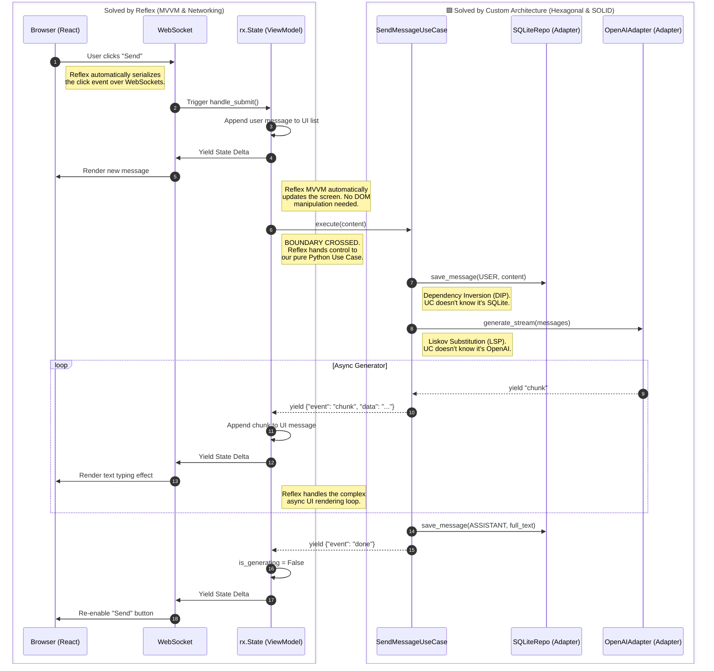

```mermaid
sequenceDiagram
    autonumber
    
    box  Solved by Reflex (MVVM & Networking)
        participant Browser as Browser (React)
        participant WS as WebSocket
        participant State as rx.State (ViewModel)
    end
    
    box 🟩 Solved by Custom Architecture (Hexagonal & SOLID)
        participant UC as SendMessageUseCase
        participant Repo as SQLiteRepo (Adapter)
        participant LLM as OpenAIAdapter (Adapter)
    end

    %% 1. User Action
    Browser->>WS: User clicks "Send"
    Note right of Browser: Reflex automatically serializes<br/>the click event over WebSockets.
    
    WS->>State: Trigger handle_submit()
    
    %% 2. Optimistic UI Update
    State->>State: Append user message to UI list
    State->>WS: Yield State Delta
    WS->>Browser: Render new message
    Note right of State: Reflex MVVM automatically<br/>updates the screen. No DOM<br/>manipulation needed.

    %% 3. Crossing the Boundary
    State->>UC: execute(content)
    Note right of State: BOUNDARY CROSSED.<br/>Reflex hands control to<br/>our pure Python Use Case.

    %% 4. Business Logic (Architecture)
    UC->>Repo: save_message(USER, content)
    Note right of UC: Dependency Inversion (DIP).<br/>UC doesn't know it's SQLite.
    
    UC->>LLM: generate_stream(messages)
    Note right of UC: Liskov Substitution (LSP).<br/>UC doesn't know it's OpenAI.

    %% 5. Streaming Loop
    loop Async Generator
        LLM-->>UC: yield "chunk"
        UC-->>State: yield {"event": "chunk", "data": "..."}
        
        State->>State: Append chunk to UI message
        State->>WS: Yield State Delta
        WS->>Browser: Render text typing effect
        Note right of State: Reflex handles the complex<br/>async UI rendering loop.
    end

    %% 6. Finalize
    UC->>Repo: save_message(ASSISTANT, full_text)
    UC-->>State: yield {"event": "done"}
    
    State->>State: is_generating = False
    State->>WS: Yield State Delta
    WS->>Browser: Re-enable "Send" button
```