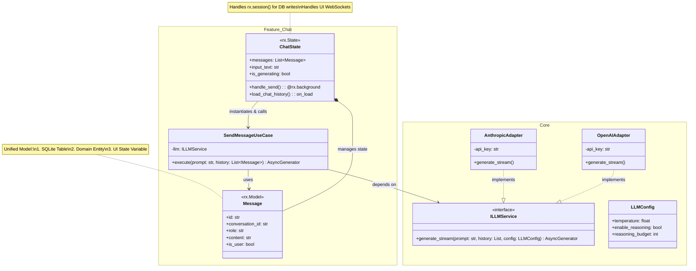

Folder structure
```
my_ai_app/
 ├── my_ai_app.py              <-- Main entry point (wires up pages)
 │
 ├── core/                     <-- Shared Infrastructure
 │    ├── database.py          <-- Reflex DB config
 │    └── llm_ports.py         <-- ILLMService interface
 │
 └── features/                 <-- SCREAMING ARCHITECTURE
      │
      ├── chat/                <-- Bounded Context
      │    ├── models.py       <-- rx.Model (DB + Domain + UI unified)
      │    ├── use_cases.py    <-- Pure Python business logic
      │    ├── state.py        <-- rx.State (The bridge between UI and Use Case)
      │    └── ui.py           <-- rx.Component (React UI)
      │
      └── knowledge_base/      <-- Bounded Context
           ├── models.py
           ├── use_cases.py
           ├── state.py
           └── ui.py
```

### Part 1: The Final Architectural Decisions (What we are taking)

1.  **The Framework:** We are dropping the separate FastAPI backend. We are using **Reflex** as a full-stack monolith to eliminate the "Double Backend" and "HTTP/SSE Parsing" taxes.
2.  **The Folder Structure:** **Vertical Slice (Screaming) Architecture**. Code is grouped by feature (`src/features/chat/`, `src/features/knowledge_base/`), not by technical type.
3.  **The Data Model (The Pragmatic Compromise):** We rejected strict separation (ADR 005). We are using **`rx.Model`** (SQLModel) as our unified Database Table, Domain Entity, and UI State to eliminate the "Boilerplate Tax."
4.  **The LLM Integration:** We are using **Custom Adapters** (implementing `ILLMService`) rather than LiteLLM, giving us strict control over edge cases like Anthropic's "Thinking" budget and multimodal attachments.
5.  **The Database Strategy:** We are using a **Shared Data Layer** with standard Foreign Keys (because Reflex demands it), rather than strict No-FK boundaries.


---


#### 2. The Context Locality Rule (Search Optimization)
*   **Directive:** "This codebase uses Vertical Slice Architecture. When fixing a bug in 'Checkout', restrict your file searches to `src/features/checkout/`. Do not pull in global controllers or unrelated domains."

#### 3. The Database Mutation Rule (CQS & Bounded Contexts)
*   **Directive:** "You may READ data across domains using standard SQLAlchemy JOINs. However, you may ONLY WRITE/MUTATE data that belongs to the specific Vertical Slice you are currently working in."

#### 4. Reflex-Specific Coding Rules (Crucial for Agents)
*   **Reactivity Rule:** "When mutating an object inside a list in an `rx.State`, you MUST reassign the list to itself (e.g., `self.messages = self.messages`) to trigger UI reactivity."
*   **Async Blocking Rule:** "Any function that calls an LLM or performs heavy I/O MUST be decorated with `@rx.background`. You must use `async with self:` to safely yield state updates to the frontend."
*   **Session Rule:** "Do not hold `rx.session()` open while waiting for an LLM response. Open the session, save the user message, close it. Stream the LLM. Open a new session, save the AI message, close it."

---

### Part 3: The Final Class Diagram

This diagram visualizes the **"Screaming Reflex Monolith."**

Notice how the "Triple Model Tax" is gone. `Message` is now a single unified class. However, notice that `SendMessageUseCase` remains pure—it still depends on the `ILLMService` interface, protecting your business logic from OpenAI/Anthropic API changes.



### The Architect's Closing Thought
You have successfully navigated the hardest part of software engineering: balancing theoretical purity with practical execution. By adopting this architecture, you have a system that is fast enough for a solo developer to build in weeks, but structured enough to scale to a team of engineers and autonomous AI agents without collapsing into a Big Ball of Mud.
